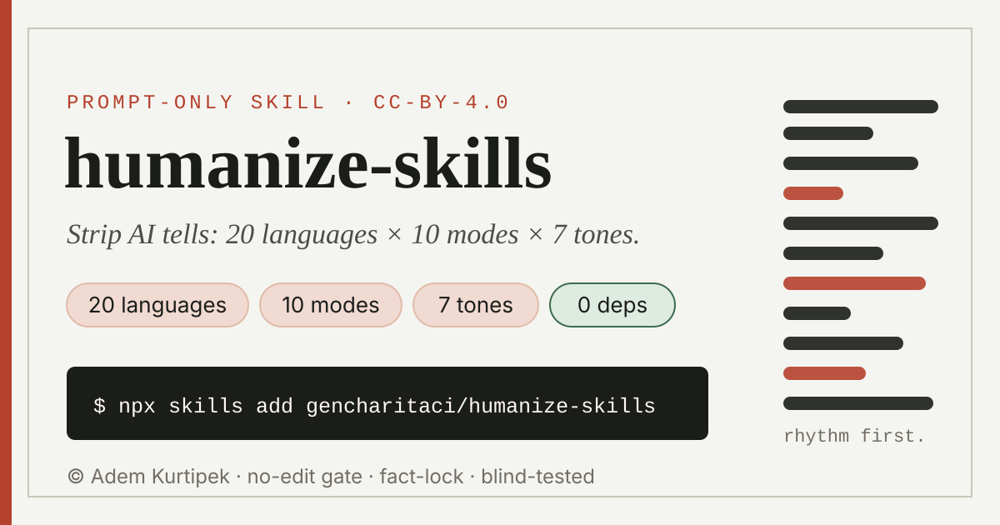

# humanize-skills



Vikipedi'nin "Signs of AI writing" rehberinde kataloglanan klişeleri, dolgu
ifadelerini ve formülsel yapıları — ayrıca kelime değişimiyle geçmeyen söylem
düzeyi izleri de dahil — bir yapay zekâ asistanının yazdığı ya da düzenlediği
her şeyden çıkaran bir yapay-zekâ yazı becerisi (skill).

- **İki aşama.** Bir yüzey aşaması (kelime hazinesi, cümle ritmi, biçimlendirme,
  sohbet-artığı kalıntılar) ve bir yapısal aşama (açıkça söylenen dersler, tek
  kanallı düzgün akışlar, gösterilmek yerine adı konan duygu, belirsiz
  göndermeler, bir külliyat boyunca şekil yakınsaması).
- **20 dil**, her biri kendi örüntü kataloğu ve register tablosuyla — çevrilmiş
  bir İngilizce kelime listesi değil: İngilizce, Çince, İspanyolca, Almanca,
  Fransızca, Rusça, Japonca, Türkçe, Korece, Vietnamca, Lehçe, Endonezyaca,
  Ukraynaca, Arapça, Portekizce, İtalyanca, Hintçe, Farsça, Hollandaca, Tayca.
- **10 amaç modu**, tek bir çekirdek kural kitabının üzerinde katmanlı:
  `general` (varsayılan), `academic`, `medical`, `legal`, `business`, `resume`,
  `ux`, `creative`, `social`, `technical`.
- **Yalnızca istem (prompt).** Tarayıcı betiği yok, çalışma-zamanı bağımlılığı
  yok — motorun tamamı Markdown.

*Bu dosya İngilizce `README.md` dosyasının Türkçe çevirisidir. Anlam farkı
olursa İngilizce sürüm geçerlidir.*

*Diller: [English](README.md) · [Türkçe](README.tr.md) · [Español](README.es.md) · [Deutsch](README.de.md) · [中文](README.zh.md) · [العربية](README.ar.md) · [Français](README.fr.md)*

## Depo yapısı

```
humanize-skills/                          ← bu depo
└── skills/
    └── humanize-skills/
        ├── SKILL.md                     ← yönlendirici: bayrakları okur, yükleme sırasını ve önceliği belirler
        └── references/
            ├── core-rules.md            ← evrensel yüzey aşaması
            ├── structural-pass.md       ← altı söylem-düzeyi denetimi
            ├── voice-calibration.md     ← ses profili nasıl kurulur (ve nasıl kurulmaz)
            ├── languages/
            │   ├── en.md zh.md es.md de.md fr.md ru.md ja.md tr.md ko.md   (1. kademe)
            │   ├── vi.md pl.md id.md uk.md ar.md pt.md it.md hi.md fa.md nl.md th.md  (2. kademe)
            │   └── _template.md         ← 21. ve sonraki diller için katkı biçimi
            └── modes/
                └── general.md academic.md medical.md legal.md business.md
                    resume.md ux.md creative.md social.md technical.md
```

`SKILL.md` her istekte yalnızca gereken dosyaları yükler (çekirdek + yapısal +
bir dil + bir mod), yani katalog toplama yoluyla büyür, tek dosya şişerek değil.
`skills/<ad>/SKILL.md` düzeni, `npx skills` yükleyicisinin (aşağıya bakın) bir
depodaki kurulabilir becerileri bulurken beklediği kuraldır.

## Nasıl kullanılır

Beceri kurulduktan sonra **normal bir istekle çağırırsın** — komut satırında
çalıştırılacak bir şey yok. Yetkin her ajan (Claude Code, Cursor, Codex, …),
"şunu daha az yapay zekâ gibi göster", "bu taslağı insanileştir", "em-dash'leri
ve dolguları temizle" gibi bir istek gördüğünde beceriyi otomatik olarak alır.

Aşağıdaki çalışma-zamanı bayrakları kabuk (shell) argümanı değil, **isteğin
içine yazdığın kelimelerdir**. İstediğin gibi birleştir; hepsini boş bırakırsan
beceri mantıklı varsayılanları kullanır (`--general` modu, metinden algılanan dil).

| Bayrak | Ne yapar | Boş bırakılırsa varsayılan |
|---|---|---|
| `--general` `--academic` `--medical` `--legal` `--business` `--resume` `--ux` `--creative` `--social` `--technical` | Amaç modu — neyin korunup neyin ayıklanacağını belirler | `--general` veya bağlamdan çıkarım (yapıştırılan sözleşme ⇒ `--legal`) |
| `--lang=xx` | Bir dil kataloğunu zorla (`en`, `zh`, `es`, `de`, `fr`, `ru`, `ja`, `tr`, `ko`, `vi`, `pl`, `id`, `uk`, `ar`, `pt`, `it`, `hi`, `fa`, `nl`, `th`) | Girdi metninden algılanır |
| `--audit` | Yalnızca teşhis — izleri ve yerlerini önem düzeyine göre (CRITICAL/HIGH/MEDIUM/LOW) listeler, **yeniden yazmaz** | Kapalı (beceri yeniden yazar ve raporlar) |
| `--strict` / `--light` | Daha derin veya daha hafif bir aşamayı zorla | Girdinin ne kadar yapay durduğuna göre öz-değerlendirme |
| `--free` / `--careful` / `--minimal` | Metnin ne kadar kısalabileceği (dolguyu sil / %80–110 aralığında tut / yalnızca tartışmasız izler) | Parçalar için `--free`, belgeler için `--careful` |
| `--write` | Mevcut metni temizlemek yerine kurallara göre yeni metin tasla | Kapalı (yeniden yazma modu) |
| `--tone=xx` | İlişkisel renklendirme: `expert` / `biz` / `human` / `social` / `landing` / `article` / `case` (çakışmada mod sınırları kazanır) | `human` (legal/medical için `expert`) |
| `--calibrate` | İsteyenin kendi sesine uyarla — 3–5 gerçek yazı örneği ver | Kapalı (nötr insan ölçütüne göre düzenler) |
| `--redo` | Becerinin kendi önceki çıktısına ikinci aşama uygula; kapsanabilir ("yalnızca ikinci paragraf") | Kapalı |

Her istek bir **ön uçuştan (pre-flight) denetimiyle** açılır: kısa girdiler
(~100 kelimeden az) puanlamayı atlar; yoksa beceri yapay-zekâ örüntü sinyallerini
0–100 puanlar ve metin zaten insanca okunuyorsa yalnızca teşhisle DURUR
(ağırlıklı koruma, `SKILL.md` içinde dile-özel istisnalar). "Yine de yeniden yaz"
dersen minimal aşamayı zorlarsın.

**Örnek istekler**

```
humanize this, --academic --lang=de
```
```
--audit this blog post — I want to see what's flagged before deciding
```
```
tighten my cover letter so it sounds like me, --resume --calibrate
[paste 3–5 things you've written]
```
```
soften the error messages in this file, --ux --light
```

Hiçbiri zorunlu değil. Kendi başına "Make this read less like ChatGPT" cümlesi,
genel modu yazdığın dilde çalıştırır. `SKILL.md`'nin ön-metası (frontmatter)
ajanın yararı için aynı bayrak listesini taşır.

### Bütün dosyalar ve uzun belgeler

Bir dosya yolu ver ya da uzun bir şey yapıştır (kabaca 1.500+ kelime veya
başlıklı bölümleri olan herhangi bir şey), **Belge modu**na geçer:

- **Önce denetim** — bir bulgu listesi (`örüntü → bölüm → önem düzeyi`),
  yeniden yazma yok, "apply the fixes" deyene kadar.
- **Yapıyı dondurur** — başlıklar, bölüm sırası, tablolar, şekiller, denklemler,
  kod, dipnotlar ve her alıntı aynen kalır; yalnızca düzyazı değişir.
- **Temiz bölümleri atlar** — no-edit (düzenlememe) geçidi bölüm bölüm çalışır.
- **Yalnızca değişen parçaları döndürür** — düzenlenen her pasaj için
  `before → after` artı kısa bir bölüm-özeti; cevapta bütün belgenin yeniden
  üretimi asla yok.
- **Aynı biçimde geri yazar** — `paper.md` → `paper.humanized.md`,
  `thesis.tex` → `thesis.humanized.tex` (LaTeX/matematik/`\cite{}` korunur);
  orijinalin üzerine asla yazılmaz. Sadıkça yeniden üretemediği biçimler
  (`.docx`, `.pdf`, …) kendi düzenleyicinde uygulayacağın parça listesini alır.

**Kurulumun yapamadığı tek şey:** kendini bir mod ya da dil alt kümesine
daraltmak. Bütün motor her seferinde kurulur (birkaç yüz KB Markdown) ve
`SKILL.md` her istekte gereken birkaç dosyayı yükler. `npx skills add …
--modes=…` veya `--langs=…` diye bir şey yok — topluluk `npx skills` CLI'ı bir
beceriye özel bayrak iletmez, tasarımın da buna ihtiyacı yok.

---

## `npx skills` ile kur (önerilen — 30+ kod ajanında çalışır)

`npx skills`, üçüncü-taraf topluluk CLI'ıdır (npm'deki `skills` paketi,
ekosistem öncüsü `vercel-labs/skills`) — bir Anthropic ürünü değil. Herkese açık
bir GitHub deposunu okur, içindeki `SKILL.md` dosyalarını bulur ve makinede
algıladığı ajanlara kopyalar ya da sembolik bağla bağlar (Claude Code, Cursor,
opencode, Codex, Kiro ve diğerleri). Senin tarafında npm yayımlama adımı gerekmez;
doğrudan depoya karşı çalışır.

> **Durum:** henüz yayımlanmadı. Aşağıdaki komutlar hedeflenen depo yolunu
> (`gencharitaci/humanize-skills`) kullanır; depo herkese açık olunca çalışmaya başlar.

### 1. Bu depoyu GitHub'a gönder
```bash
git init
git add .
git commit -m "Add humanize-skills"
git remote add origin https://github.com/gencharitaci/humanize-skills.git
git branch -M main
git push -u origin main
```
Depo **herkese açık** olmalı — `npx skills` varsayılan olarak düz HTTPS ile okur.

### 2. Kur
```bash
npx skills add gencharitaci/humanize-skills
```
Bulduğu tek beceriyi listeler (`humanize-skills`) ve hangi ajan(lar)a kurulacağını
sorar. Etkileşimsiz kurulum için:
```bash
npx skills add gencharitaci/humanize-skills --skill humanize-skills -a claude-code -y
```
Yararlı varyasyonlar:
```bash
# Hiçbir şey kurmadan depoda ne olduğunu önizle
npx skills add gencharitaci/humanize-skills --list

# Yalnızca mevcut proje yerine global kur (bütün projelerin)
npx skills add gencharitaci/humanize-skills --skill humanize-skills -g -y

# Makinede algıladığı her ajana kur
npx skills add gencharitaci/humanize-skills --skill humanize-skills -a '*' -y
```
`npx skills` varsayılan olarak sembolik bağ kurar, güncellemeler canlı olur;
sembolik bağların yükseltilmiş izin gerektirdiği Windows'ta `--copy` ekle ve bir
değişiklikten sonra `npx skills update` komutunu yeniden çalıştır.
Becerinin tamamı Markdown — `references/` klasörü `SKILL.md` ile otomatik gelir.

### 3. Doğrula, güncelle ya da kaldır
```bash
npx skills list                          # kurulduğunu doğrula
npx skills update                        # depondan en son sürümü çek
npx skills remove humanize-skills        # kaldır (global kurulduysa -g ekle)
```

### 4. Elle kurulum yolları — npx yoksa

Yukarıdaki `npx skills`, aşağıdaki dizinlere otomatik yazar. CLI kurulumunu
kapsamıyorsa `skills/humanize-skills/` klasörünü elle kopyala. Proje yolları depo
köküne göredir; global yollar ev dizinine.

| Ajan | Proje yolu | Global yol |
|---|---|---|
| Claude Code | `.claude/skills/humanize-skills/` | `~/.claude/skills/humanize-skills/` |
| Codex CLI | `.codex/skills/humanize-skills/` | `~/.codex/skills/humanize-skills/` |
| Cursor | `.cursor/skills/humanize-skills/` | `~/.cursor/skills/humanize-skills/` |
| opencode | `.opencode/skills/humanize-skills/` | `~/.config/opencode/skills/humanize-skills/` |
| Kilo Code | `.kilocode/skills/humanize-skills/` | `~/.kilocode/skills/humanize-skills/` |
| Gemini CLI | `.gemini/skills/humanize-skills/` | `~/.gemini/skills/humanize-skills/` |
| Ortak yedek (Amp, Roo, Copilot, diğerleri) | `.agents/skills/humanize-skills/` | `~/.agents/skills/humanize-skills/` |

```bash
# Örnek: opencode, proje-yerel
cp -r skills/humanize-skills .opencode/skills/humanize-skills
# Örnek: Kilo Code, global (PowerShell)
Copy-Item -Recurse skills/humanize-skills ~/.kilocode/skills/humanize-skills
```

opencode ayrıca Claude-uyumlu (`.claude/skills/`) ve ajan-uyumlu
(`.agents/skills/`) yolları da okur, Cursor da ikisini okur — iki konumdan
birine tek kopya, aynı makinede iki ajana da hizmet eder. Beceri ön-metası
yalnızca her ajanın okuduğu ortak çekirdek alanları kullanır (`name`,
`description`, `license`); bilinmeyen alanlar yok sayılır, ajana-özel varyant
gerekmez. Ajanın kendi beceri listesiyle doğrula (Claude Code: `/skills`;
opencode: `skill` aracı; Cursor: **Customize → Skills**), sonra düz kelimelerle
çağır — "humanize this, --academic" her yerde aynı çalışır.

---

## Alternatif: doğrudan Claude'a kur (npx yok, GitHub gerekmez)

Depo yayımlamak istemiyorsan beceriyi Claude'a elden verebilirsin.

### Claude.ai, Claude Desktop ya da Cowork
1. Yalnızca içteki `humanize-skills/` klasörünü zip'le (`SKILL.md`'yi doğrudan
   içeren klasör — dıştaki `skills/` sarmalayıcı klasör **değil**), böylece
   `references/` zip içinde `SKILL.md`'nin yanında kalır:
    ```bash
    cd skills && zip -r humanize-skills.zip humanize-skills
    ```
2. Uygulamada: **Settings → Customize → Skills → + → + Create skill** → o ZIP'i yükle.
3. Düğmenin açık olduğunu doğrula. *Team/Enterprise:* kuruluş sahibi bunun yerine
   **Organization settings → Skills** üzerinden herkese sağlayabilir; iki durumda da
   önce **Code execution and file creation** ile **Skills** açık olmalı.

### Claude Code (manuel, npx yok)
```bash
cp -r skills/humanize-skills ~/.claude/skills/humanize-skills      # kişisel, bütün projeler
# veya
cp -r skills/humanize-skills .claude/skills/humanize-skills        # yalnızca bu proje
```
Bir oturum içinde `/skills` ile ya da `claude --list-skills` ile doğrula.

### Claude API
Messages API'de `container.skills` üzerinden ver (Code Execution Tool betası
gerekir) — güncel istek biçimi için Anthropic'in "Using Agent Skills with the API"
belgesine bak. `SKILL.md` ile bütün `references/` ağacını birlikte yükle.

---

## ChatGPT, Gemini ya da başka bir asistanla kullanma

Bu araçlar `SKILL.md` klasör biçimini okumaz ve bu beceri tek başına duran bir
istem değil, bir yönlendiricidir — o yüzden isteğin gerektirdiği parçaları birleştirip
aracın kalıcı-talimat alanına yapıştır (ChatGPT Custom Instructions ya da bir
projenin talimatları, bir Gemini Gem talimatları ya da eşdeğer sistem-istemi):

1. `skills/humanize-skills/SKILL.md` — ön-metanin altındaki gövde (no-edit
   geçidi, yükleme sırası, öncelik, fact-lock).
2. `references/core-rules.md` ve `references/structural-pass.md` — her zaman.
3. `references/languages/<dilin>.md` — yazdığın dilin kataloğu.
4. `references/modes/<modun>.md` — emin değilsen `general.md`.
5. Yalnızca ses eşleştirme istersen: `references/voice-calibration.md`.

Birleştirilmiş hali birkaç sayfa eder — özel-talimat alanına rahat sığar. Dil
dosyasını yalnızca dilin için özel dosya yoksa atla; o durumda araca böyle
söyle ve doğaçlama yapması yerine yalnız `core-rules.md` uygulamasına bırak.

---

## Dürüst bir not

Bu beceri, yazıyı formülsel gösteren örüntüleri kaldırır ve bu tesadüfen onu
örüntü-tabanlı yapay-zekâ dedektörlerine daha az yakalanır yapar — çünkü kaldırdığı
şey tam olarak budur. Bu, algılanmaya karşı garanti değildir; dedektörler iki yönde
de güvenilmezdir ve belirli bir bağlamda açıklama borcun olup olmadığını değiştirmez.
Yapay zekâ yardımını açıklamayı gerektiren bir yerde kullanıyorsan — bir okul
politikası, bir yayının kuralları, Vikipedi'nin açıklanmamış LLM-içeriği yasağı —
bir üslup kılavuzunu izlemek o gerekliliği karşılamaz. Sadece düzyazıyı iyileştirir.

---

## Katkıda bulunma

En değerli iki katkı: dil kataloglarının **anadili incelemesi** ve altın
örnekler (fixture) üzerinde **kör zorunlu-seçim denetimini çalıştırmak**. Bkz.
[`CONTRIBUTING.md`](CONTRIBUTING.md). `references/examples/` örnekleri şu anda
model-üretimi ve incelenmemiş — doğrulanmış altın standart değil, regresyon
tetikleyicileridir.

## Lisans

CC BY 4.0 (Creative Commons Attribution 4.0 International) — bkz.
[`LICENSE.md`](LICENSE.md). © Adem Kurtipek. Atıfla, ticari dahil paylaşım ve
uyarlama serbesttir.
